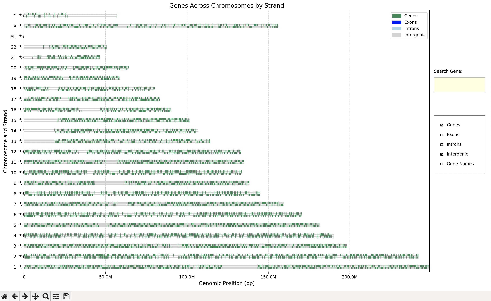

# Chromoscopy

Interactive Visualization of Gene Structures on Chromosomes Using Python

<div align="center">  <p><em>Figure 1: Chromoscopy Interface</em></p> </div> 

## Prerequisites

- **Python 3.7+**  
  [Download Python](https://www.python.org/downloads/)
- **Git**  
  [Download Git](https://git-scm.com/downloads)

## Installation

1. **Clone the repository:**

   ```bash
   git clone https://github.com/bernhard-buss/chromoscopy.git
   cd chromoscopy
   ```

2. **Create a virtual environment:**

   ```bash
   python -m venv .venv
   ```

3. **Activate the virtual environment:**

   - **Windows:**

     ```bash
     .venv\Scripts\activate
     ```

   - **Unix/MacOS:**

     ```bash
     source .venv/bin/activate
     ```

4. **Install dependencies:**

   ```bash
   pip3 install -r requirements.txt
   ```

## Usage

### Setup Reference and Annotations

Download reference FASTA files (e.g. from [ensembl.org](https://www.ensembl.org/Homo_sapiens/Info/Index)) and save in folder 'reference'.

Should look like this (for each chromosome):
`reference/Homo_sapiens.GRCh38.dna.chromosome.1.fa`

Download annotations gtf file (e.g. from [ensembl.org](https://www.ensembl.org/Homo_sapiens/Info/Index)) and save in folder 'gtf'.

Should look like this:
`gtf/Homo_sapiens.GRCh38.113.gtf`

Then use the 'split_gtf.py' function to split into individual gtf files per chromosome, e.g. using python console:

```python
from split_gtf import split_gtf_by_chromosome
gtf_file = 'gtf/Homo_sapiens.GRCh38.113.gtf'
split_gtf_by_chromosome(gtf_file)
```

### Start Chromoscopy

Run the main application:

```bash
python3 chromoscopy.py
```

Note: you may have to adjust the matplotlib renderer to be used in chromoscopy.py if not using MacOSX:

```# matplotlib.use('TkAgg')  # Use 'TkAgg' for interactive features (default: 'MacOSX')```

